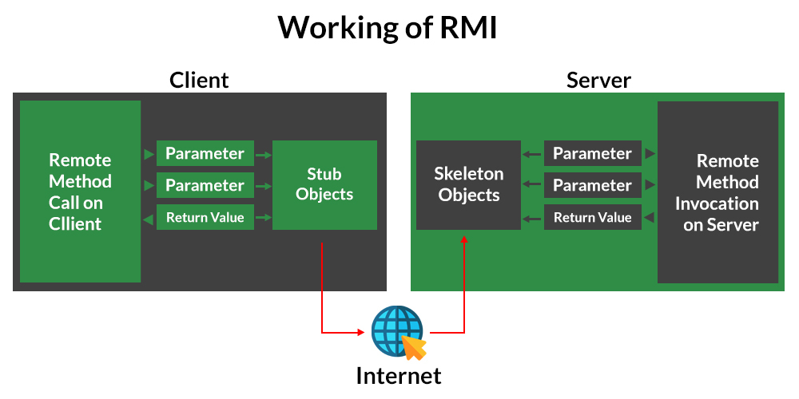

# Salle De Discussion 
Une application de chat utilisant l'invocation de méthode à distance Java (RMI)

## Table des matières
- [Introduction](#introduction)
- [Fonctionnalités](#fonctionnalités)
- [Environnement de Développement](#environnement-de-développement)
- [Installation](#installation)
- [Utilisation](#utilisation)
- [Contributions](#contributions)
- [Licence](#licence)

## Introduction
- **Invocation de méthode à distance en Java**: 

  L'invocation de méthode à distance (RMI) est une API qui permet à un objet d'invoquer une méthode sur un objet qui existe dans un autre espace d'adressage, qui peut se trouver sur la même machine ou sur une machine distante. Grâce à RMI, un objet exécuté dans une JVM présente sur un ordinateur (côté client) peut invoquer des méthodes sur un objet présent dans une autre JVM (côté serveur). RMI crée un objet serveur distant public qui permet les communications côté client et serveur via de simples appels de méthode sur l'objet serveur.

- Objet stub : l'objet stub sur la machine client crée un bloc d'informations et envoie ces informations au serveur.

  **Le bloc est composé de**
  - Un identifiant de l'objet distant à utiliser
  - Nom de la méthode à appeler
  - Paramètres de la JVM distante

- Objet squelette : l'objet squelette transmet la demande de l'objet stub à l'objet distant. Il effectue les tâches suivantes

  - Il appelle la méthode souhaitée sur l'objet réel présent sur le serveur.
  - Il transmet les paramètres reçus de l'objet stub à la méthode. 

**Fonctionnement du RMI** :

La communication entre le client et le serveur est gérée à l'aide de deux objets intermédiaires : l'objet Stub (côté client) et l'objet Skeleton (côté serveur), comme cela peut également être représenté à partir du support ci-dessous comme suit :

## Fonctionnalités
## Environnement de Développement
## Installation
## Utilisation
## Contributeurs
## Licence
